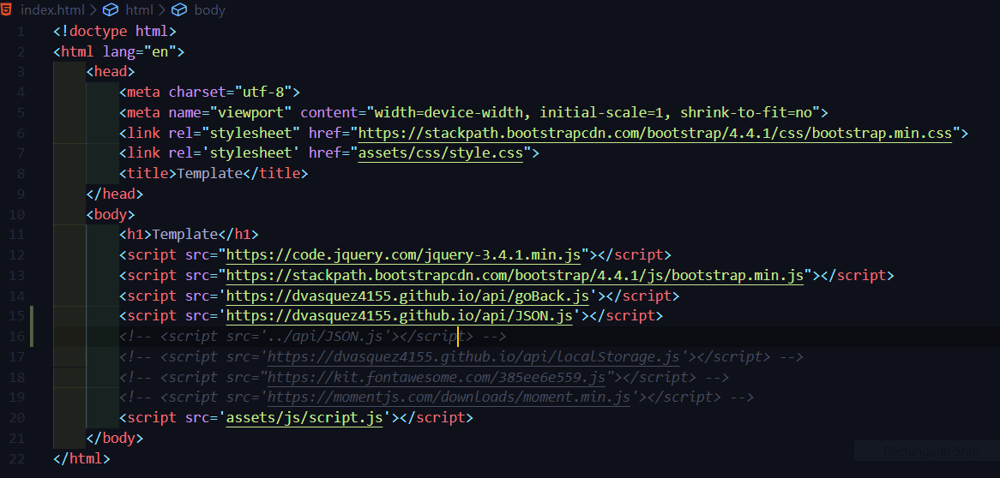

# Template 1.0
   
## Description

A simple template that I am using. It includes scripts that are useful to me.
## Credits
[ Daniel Vasquez Talavera](https://github.com/DVasquez4155)
## Contributing
This project has adopted the code of conduct defined by [Contributor Covenant](https://www.contributor-covenant.org/version/2/0/code_of_conduct/).
## License
Licensed under the [MIT License](https://choosealicense.com/licenses/mit/) license.